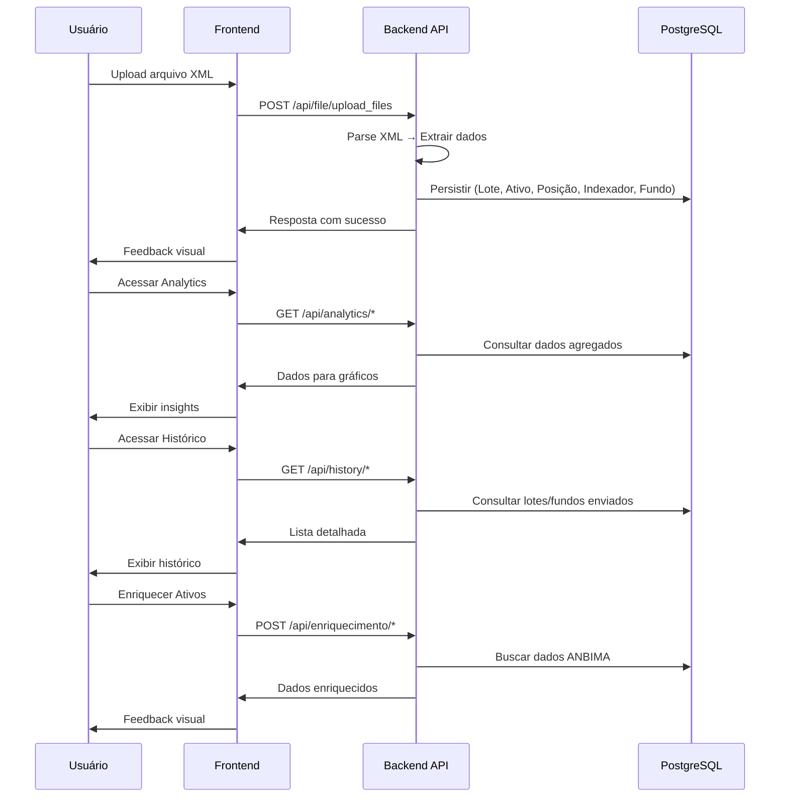

# FundSys - Sistema de Gestão de Fundos de Investimento


## 🛠️ Tecnologias Utilizadas

<div style="display: flex; gap: 10px; flex-wrap: wrap;">
  
  
  
  
  
  
  
  
  
  
  
  
  
</div>

---

## 📚 Sumário

- [FundSys - Sistema de Gestão de Fundos de Investimento](#fundsys---sistema-de-gestão-de-fundos-de-investimento)
  - [🛠️ Tecnologias Utilizadas](#️-tecnologias-utilizadas)
  - [📚 Sumário](#-sumário)
  - [Visão Geral](#visão-geral)
  - [📐 Arquitetura](#-arquitetura)
  - [🔄 Fluxo de Processamento](#-fluxo-de-processamento)
  - [Stack \& Serviços](#stack--serviços)
    - [Backend](#backend)
    - [Frontend](#frontend)
    - [DevOps](#devops)
  - [Estrutura de Pastas](#estrutura-de-pastas)
  - [Pré-requisitos](#pré-requisitos)
  - [Como Rodar](#como-rodar)
    - [Clonar o repositório](#clonar-o-repositório)
    - [Configurar variáveis de ambiente](#configurar-variáveis-de-ambiente)
    - [Subir com Docker Compose](#subir-com-docker-compose)
    - [Acompanhar logs](#acompanhar-logs)
    - [Testes rápidos](#testes-rápidos)
  - [Portas \& URLs](#portas--urls)
  - [Endpoints](#endpoints)
    - [Upload de Arquivos](#upload-de-arquivos)
    - [Analytics](#analytics)
    - [Histórico](#histórico)
    - [Fundos](#fundos)
    - [Enriquecimento ANBIMA](#enriquecimento-anbima)
  - [Funcionalidades Principais](#funcionalidades-principais)
    - [📤 Upload e Processamento](#-upload-e-processamento)
    - [📊 Analytics e Insights](#-analytics-e-insights)
    - [📋 Histórico](#-histórico)
    - [🎨 Interface](#-interface)
    - [🏗️ Arquitetura](#️-arquitetura)
  - [Histórico de Evolução](#histórico-de-evolução)
    - [🚀 **Versão 0.1.0** - Setup Inicial](#-versão-010---setup-inicial)
    - [🏗️ **Versão 0.2.0** - Arquitetura MSC](#️-versão-020---arquitetura-msc)
    - [🎨 **Versão 0.3.0** - Frontend](#-versão-030---frontend)
    - [📊 **Versão 0.4.0** - Analytics](#-versão-040---analytics)
    - [🔄 **Versão 0.5.0** - Refinamentos](#-versão-050---refinamentos)
    - [📈 **Versão 0.6.0** - Enriquecimento de Ativos](#-versão-060---enriquecimento-de-ativos)
    - [💰 **Versão 0.7.0** - Fundos de Investimento](#-versão-070---fundos-de-investimento)
    - [🎨 **Versão 0.8.0** - UX \& UI Refinements](#-versão-080---ux--ui-refinements)
  - [Autor](#autor)

---

## Visão Geral

O **FundSys** é um sistema completo para gestão de fundos de investimento que permite:

- **Upload e processamento** de arquivos XML de posições de fundos
- **Análise e insights** com gráficos e métricas detalhadas
- **Histórico de lotes e fundos** enviados com filtros e busca
- **Enriquecimento automático** de ativos com dados da ANBIMA
- **Interface responsiva** com modo claro/escuro
- **Arquitetura MSC** (Model-Service-Controller) no backend
- **Persistência robusta** com PostgreSQL e migrações automáticas

---

## 📐 Arquitetura

A aplicação é composta por 3 serviços principais:

- **Backend API** → FastAPI com arquitetura MSC (Python)
- **Frontend** → React + Vite + Tailwind CSS
- **Database** → PostgreSQL com Alembic para migrações

## 🔄 Fluxo de Processamento



---

## Stack & Serviços

### Backend
- **Python 3.13** + **FastAPI**
- **SQLAlchemy** + **Alembic** (ORM e migrações)
- **PostgreSQL** (banco de dados)
- **Pydantic** (validação de dados)
- **Poetry** (gerenciamento de dependências)
- **Docker** (containerização)
- **BeautifulSoup4 / Requests** (coleta e parsing de dados ANBIMA)

### Frontend
- **React 19**
- **Vite** (build tool)
- **Tailwind CSS** (estilização)
- **React Query** (gerenciamento de estado)
- **Axios** (cliente HTTP)
- **Lucide React** (ícones)
- **shadcn/ui** (componentes)
- **Hooks customizados** (`useTheme`, `usePageTitle`)

### DevOps
- **Docker Compose** (orquestração)
- **Alembic** (migrações automáticas)
- **Logging estruturado** (com stack trace)
- **Entrypoint script** (aguarda banco e roda migrações)

---

## Estrutura de Pastas

```
fundsys-project/
├── backend/
│   ├── app/
│   │   ├── controllers/     # Controllers (rotas da API)
│   │   ├── services/        # Regras de negócio
│   │   ├── models/          # Modelos SQLAlchemy
│   │   ├── schemas/         # Schemas Pydantic
│   │   ├── DTOs/            # Data Transfer Objects
│   │   ├── persiste/        # Camada de persistência
│   │   │   ├── queries/     # Consultas específicas
│   │   │   └── util/        # Funções de inserção
│   │   ├── migrations/      # Migrações Alembic
│   │   └── config/          # Configurações
│   ├── main.py              # Aplicação FastAPI
│   └── Dockerfile
├── frontend/
│   ├── src/
│   │   ├── components/      # Componentes React
│   │   ├── pages/           # Páginas da aplicação
│   │   ├── hooks/           # Custom hooks
│   │   ├── routes/          # Configuração de rotas
│   │   └── styles/          # Estilos Tailwind
│   ├── public/              # Arquivos estáticos
│   └── Dockerfile
└── docker-compose.yaml
```

---

## Pré-requisitos

- **Docker 27+** e **Docker Compose v2**
- Portas livres: `8000`, `5500`, `5432`
- **Git** para clonagem do repositório

---

## Como Rodar

### Clonar o repositório
```bash
git clone git@github.com:lucaspbueno/fundsys-project.git
cd fundsys-project
```

### Configurar variáveis de ambiente
```bash
mv .env-exemple .env
```

### Subir com Docker Compose
```bash
docker compose up -d --build
```

### Acompanhar logs
```bash
docker compose logs -f
```

### Testes rápidos
```bash
curl -s http://localhost:8000/api/analytics/overview | jq .
```

---

## Portas & URLs

- **Frontend** → `http://localhost:5500`
- **Backend API** → `http://localhost:8000`
- **PostgreSQL** → `localhost:5432`
- **Documentação API** → `http://localhost:8000/docs`

---

## Endpoints

### Upload de Arquivos
- `POST /api/file/upload_files` → Upload e processamento de XML

### Analytics
- `GET /api/analytics/overview`
- `GET /api/analytics/indexadores`
- `GET /api/analytics/ativos`
- `GET /api/analytics/evolucao-mensal`

### Histórico
- `GET /api/history/files`
- `GET /api/history/files/{id}`
- `GET /api/history/files/{id}/analytics`

### Fundos
- `POST /api/fundos/upload`
- `GET /api/fundos`
- `GET /api/fundos/{id}`

### Enriquecimento ANBIMA
- `POST /api/enriquecimento/start`
- `GET /api/enriquecimento/status`
- `GET /api/enriquecimento/ativos`

---

## Funcionalidades Principais

### 📤 Upload e Processamento
- Drag & Drop de arquivos XML
- Parse automático de fundos e ativos
- Validação com Pydantic
- Feedback visual de sucesso/erro

### 📊 Analytics e Insights
- Visão geral consolidada
- Distribuição por indexadores (DI1, IPCA, PRE)
- Análise de ativos e evolução mensal
- Filtros por fundo, data e ativo

### 📋 Histórico
- Lista cronológica de lotes e fundos enviados
- Busca e filtros avançados
- Detalhes de cada fundo/lote
- Analytics específicos

### 🎨 Interface
- Design minimalista
- Modo claro/escuro (hook `useTheme`)
- Hooks customizados (`usePageTitle`)
- Sistema de notificações (sucesso, erro, aviso, info, confirmação)

### 🏗️ Arquitetura
- MSC Pattern (Model-Service-Controller)
- Migrações automáticas com Alembic
- Logging estruturado e stack trace
- Validação robusta de dados

---

## Histórico de Evolução

### 🚀 **Versão 0.1.0** - Setup Inicial
### 🏗️ **Versão 0.2.0** - Arquitetura MSC
### 🎨 **Versão 0.3.0** - Frontend
### 📊 **Versão 0.4.0** - Analytics
### 🔄 **Versão 0.5.0** - Refinamentos
### 📈 **Versão 0.6.0** - Enriquecimento de Ativos
- Rotas ANBIMA, tabela `ativo_enriquecido`, execução em background

### 💰 **Versão 0.7.0** - Fundos de Investimento
- Upload, listagem e detalhes de fundos
- Novo modelo `ArquivoOriginal`

### 🎨 **Versão 0.8.0** - UX & UI Refinements
- Hooks (`useTheme`, `usePageTitle`)
- Notificações, modais e componentes shadcn/ui
- Modo claro/escuro e ícones dinâmicos

---

## Autor

Desenvolvido por [Lucas Bueno](https://github.com/lucaspbueno) 🚀