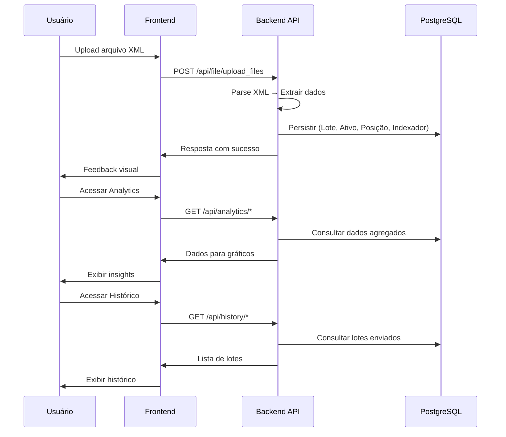

# FundSys - Sistema de Gestão de Fundos de Investimento


## 🛠️ Tecnologias Utilizadas

<div style="display: flex; gap: 10px; flex-wrap: wrap;">
  
  
  
  
  
  
  
  
  
  
  
  
</div>

---

## 📚 Sumário

- [FundSys - Sistema de Gestão de Fundos de Investimento](#fundsys---sistema-de-gestão-de-fundos-de-investimento)
  - [🛠️ Tecnologias Utilizadas](#️-tecnologias-utilizadas)
  - [📚 Sumário](#-sumário)
  - [Visão Geral](#visão-geral)
  - [📐 Arquitetura](#-arquitetura)
  - [🔄 Fluxo de Processamento](#-fluxo-de-processamento)
  - [Stack \& Serviços](#stack--serviços)
    - [Backend](#backend)
    - [Frontend](#frontend)
    - [DevOps](#devops)
  - [Estrutura de Pastas](#estrutura-de-pastas)
  - [Pré-requisitos](#pré-requisitos)
  - [Como Rodar](#como-rodar)
    - [5.1 Clonar o repositório](#51-clonar-o-repositório)
    - [5.2 Configurar variáveis de ambiente](#52-configurar-variáveis-de-ambiente)
    - [5.3 Subir com Docker Compose](#53-subir-com-docker-compose)
    - [5.4 Acompanhar logs](#54-acompanhar-logs)
    - [5.5 Testes rápidos](#55-testes-rápidos)
    - [5.6 Encerrar/limpar](#56-encerrarlimpar)
  - [Portas \& URLs](#portas--urls)
  - [Endpoints](#endpoints)
    - [Backend API](#backend-api)
      - [Upload de Arquivos](#upload-de-arquivos)
      - [Analytics](#analytics)
      - [Histórico](#histórico)
    - [Frontend](#frontend-1)
  - [Funcionalidades Principais](#funcionalidades-principais)
    - [📤 Upload e Processamento](#-upload-e-processamento)
    - [📊 Analytics e Insights](#-analytics-e-insights)
    - [📋 Histórico](#-histórico)
    - [🎨 Interface](#-interface)
    - [🏗️ Arquitetura](#️-arquitetura)
  - [Histórico de Evolução](#histórico-de-evolução)
    - [🚀 **Versão 0.1.0** - Setup Inicial](#-versão-010---setup-inicial)
    - [🏗️ **Versão 0.2.0** - Arquitetura MSC](#️-versão-020---arquitetura-msc)
    - [🎨 **Versão 0.3.0** - Frontend](#-versão-030---frontend)
    - [📊 **Versão 0.4.0** - Analytics](#-versão-040---analytics)
    - [🔄 **Versão 0.5.0** - Refinamentos](#-versão-050---refinamentos)
  - [Autor](#autor)

---

## Visão Geral

O **FundSys** é um sistema completo para gestão de fundos de investimento que permite:

- **Upload e processamento** de arquivos XML de posições de fundos
- **Análise e insights** com gráficos e métricas detalhadas
- **Histórico de lotes** enviados com filtros e busca
- **Interface responsiva** com modo claro/escuro
- **Arquitetura MSC** (Model-Service-Controller) no backend
- **Persistência robusta** com PostgreSQL e migrações automáticas

---

## 📐 Arquitetura

A aplicação é composta por 3 serviços principais:

- **Backend API** → FastAPI com arquitetura MSC (Python)
- **Frontend** → React + Vite + Tailwind CSS
- **Database** → PostgreSQL com Alembic para migrações

## 🔄 Fluxo de Processamento



---

## Stack & Serviços

### Backend
- **Python 3.13** + **FastAPI**
- **SQLAlchemy** + **Alembic** (ORM e migrações)
- **PostgreSQL** (banco de dados)
- **Pydantic** (validação de dados)
- **Poetry** (gerenciamento de dependências)
- **Docker** (containerização)

### Frontend
- **React 18** + **TypeScript**
- **Vite** (build tool)
- **Tailwind CSS** (estilização)
- **React Query** (gerenciamento de estado)
- **Axios** (cliente HTTP)
- **Lucide React** (ícones)
- **shadcn/ui** (componentes)

### DevOps
- **Docker Compose** (orquestração)
- **Alembic** (migrações automáticas)
- **Logging estruturado**

---

## Estrutura de Pastas

```
fundsys-project/
├── backend/
│   ├── app/
│   │   ├── controllers/     # Controllers (rotas da API)
│   │   ├── services/        # Regras de negócio
│   │   ├── models/          # Modelos SQLAlchemy
│   │   ├── schemas/         # Schemas Pydantic
│   │   ├── DTOs/           # Data Transfer Objects
│   │   ├── persiste/       # Camada de persistência
│   │   │   ├── queries/    # Consultas específicas
│   │   │   └── util/       # Funções de inserção
│   │   ├── migrations/     # Migrações Alembic
│   │   └── config/         # Configurações
│   ├── main.py             # Aplicação FastAPI
│   └── Dockerfile
├── frontend/
│   ├── src/
│   │   ├── components/     # Componentes React
│   │   ├── pages/         # Páginas da aplicação
│   │   ├── hooks/         # Custom hooks
│   │   ├── routes/        # Configuração de rotas
│   │   └── styles/        # Estilos Tailwind
│   ├── public/            # Arquivos estáticos
│   └── Dockerfile
└── docker-compose.yaml
```

---

## Pré-requisitos

- **Docker 27+** e **Docker Compose v2**
- Portas livres: `8000`, `5500`, `5432`
- **Git** para clonagem do repositório

---

## Como Rodar

### 5.1 Clonar o repositório
```bash
git clone git@github.com:lucaspbueno/fundsys-project.git
cd fundsys-project
```

### 5.2 Configurar variáveis de ambiente
Na raiz do projeto existe um arquivo de exemplo com as variáveis já configuradas:

```bash
mv .env-exemple .env
```

As variáveis já estão configuradas no arquivo de exemplo. Se necessário, você pode ajustar as configurações editando o arquivo `.env`.

### 5.3 Subir com Docker Compose
```bash
docker compose up -d --build
```

Verifique o status:
```bash
docker compose ps
```

### 5.4 Acompanhar logs
**Todos os serviços:**
```bash
docker compose logs -f
```

**Serviço específico:**
```bash
docker logs -f fundsys_api
docker logs -f fundsys_frontend
docker logs -f fundsys_db
```

### 5.5 Testes rápidos
```bash
# Health check da API
curl -s http://localhost:8000/ | jq .

# Testar upload de arquivo
curl -X POST "http://localhost:8000/api/file/upload_files" \
  -F "files=@seu_arquivo.xml" \
  -H "accept: application/json"

# Testar analytics
curl -s http://localhost:8000/api/analytics/overview | jq .

# Testar histórico
curl -s http://localhost:8000/api/history/files | jq .
```

### 5.6 Encerrar/limpar
```bash
# Parar serviços
docker compose down

# Parar e remover volumes (apaga dados)
docker compose down -v
```

---

## Portas & URLs

- **Frontend** → `http://localhost:5500`
- **Backend API** → `http://localhost:8000`
- **PostgreSQL** → `localhost:5432`
- **Documentação API** → `http://localhost:8000/docs`

---

## Endpoints

### Backend API

#### Upload de Arquivos
- `POST /api/file/upload_files` → Upload e processamento de XML

#### Analytics
- `GET /api/analytics/overview` → Visão geral dos dados
- `GET /api/analytics/indexadores` → Distribuição por indexadores
- `GET /api/analytics/ativos` → Análise de ativos
- `GET /api/analytics/evolucao-mensal` → Evolução mensal

#### Histórico
- `GET /api/history/files` → Lista lotes enviados
- `GET /api/history/files/{lote_id}` → Detalhes de lote específico
- `GET /api/history/files/{lote_id}/analytics` → Analytics de lote específico

### Frontend

- `/` → Página inicial (upload)
- `/insights` → Analytics e gráficos
- `/history` → Histórico de lotes
- `/ajuda` → Página de ajuda

---

## Funcionalidades Principais

### 📤 Upload e Processamento
- **Drag & Drop** para upload de arquivos XML
- **Parse automático** de dados de fundos de investimento
- **Validação** de dados com Pydantic
- **Feedback visual** de sucesso/erro

### 📊 Analytics e Insights
- **Visão geral** com métricas consolidadas
- **Distribuição por indexadores** (DI1, IAP, PRE)
- **Análise de ativos** com top performers
- **Evolução mensal** dos investimentos
- **Filtros** por lote específico

### 📋 Histórico
- **Lista cronológica** de lotes enviados
- **Busca e filtros** por nome/data
- **Detalhes completos** de cada lote
- **Analytics específicos** por lote

### 🎨 Interface
- **Design minimalista** com paleta "baby green"
- **Modo claro/escuro** responsivo
- **Layout adaptativo** para todos os dispositivos
- **Componentes reutilizáveis** (shadcn/ui)

### 🏗️ Arquitetura
- **MSC Pattern** (Model-Service-Controller)
- **Separação de responsabilidades** clara
- **Migrações automáticas** com Alembic
- **Logging estruturado** para debugging
- **Validação robusta** de dados

---

## Histórico de Evolução

### 🚀 **Versão 0.1.0** - Setup Inicial
- Configuração inicial do projeto
- Setup do FastAPI + SQLAlchemy
- Configuração do PostgreSQL
- Estrutura básica de modelos

### 🏗️ **Versão 0.2.0** - Arquitetura MSC
- Implementação da arquitetura Model-Service-Controller
- Criação de DTOs e schemas Pydantic
- Sistema de migrações com Alembic
- Refatoração para Poetry

### 🎨 **Versão 0.3.0** - Frontend
- Criação do frontend React + Vite
- Implementação do sistema de upload
- Interface com Tailwind CSS
- Integração com React Query

### 📊 **Versão 0.4.0** - Analytics
- Sistema de analytics e insights
- Gráficos e visualizações
- Página de histórico
- Modo escuro/claro

### 🔄 **Versão 0.5.0** - Refinamentos
- Melhorias de responsividade
- Sistema de notificações
- Otimizações de performance
- Documentação completa

---

## Autor

Desenvolvido por [Lucas Bueno](https://github.com/lucaspbueno) 🚀

---